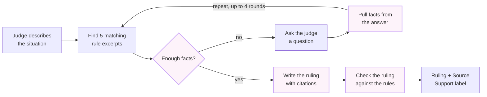

# PokeJudge improvement plan

Started 2026-09-26.

PokeJudge can get more accurate and cheaper by doing six things in order: make its answers repeatable, fix the test that grades it, make fewer AI calls, feed it better rule text, match the AI model to each job, and only then choose where to run it.

## The plan at a glance

The first two steps are free and make every later measurement trustworthy, so they come first. Each later step is tested against the same 20 practice scenarios before moving on.

| # | Step | What changes | Effort | Cost to try | Expected result |
| --- | --- | --- | --- | --- | --- |
| 1 | Make answers repeatable | Pin the model version and send a fixed seed (done) | A few lines of code | Free | The same question gives the same answer every time |
| 2 | Fix the test | Correct wrong expectations; add a simulated judge that answers questions (done) | A few days | Free to a few cents | The score reflects PokeJudge, not flaws in the test |
| 3 | Make fewer AI calls | Merge two calls into one; skip checks code can already do | 1 to 2 days | Free | About 25 to 40% cheaper and faster per ruling |
| 4 | Better rule text | Retrieve more rule text, or test giving the AI the whole rulebook | 1 to 3 days | Free to $0.30 per scenario | Fewer rulings built on the wrong rules |
| 5 | Right model for each job | Cheap model for simple steps, strong model for judgment | 1 day | Pennies | Same or better accuracy for less money |
| 6 | Choose where to run it | Pick Gemini, a local model, or Claude based on steps 1 to 5 | Hours | $0 to $5 per full test | A clear price per ruling, with evidence behind it |

## How PokeJudge works today

Every ruling goes through a short conversation: PokeJudge looks up the rules, decides whether it knows enough, asks the judge questions until it does, then writes and double-checks a ruling. Each highlighted box is a request to an AI model, which costs time and money.

Highlighted boxes are one paid AI call each (about 6 calls per ruling today).

A typical ruling goes around the question loop about 2.5 times, which is why it adds up to about 6 AI calls.

**Key terms used in this plan**

- **AI model:** the program that reads text and writes answers. PokeJudge uses Google's Gemini today; Qwen (runs on your own PC) and Claude were also tested.
- **AI call:** one request to the model. Each call takes a few seconds and costs a small amount of money or free quota.
- **Rule excerpt (chunk):** a paragraph-sized piece of a rulebook. The four rulebooks are split into 515 excerpts.
- **Retrieval:** searching those excerpts for the 5 that best match the situation, so the AI reads only the relevant rules.
- **Token:** the unit AI companies charge by, roughly 4 characters of English text.
- **Temperature:** a setting for how random the AI's word choices are. High means varied, 0 means as repeatable as possible.
- **Eval (the test):** 20 practice scenarios with the expected behavior written down, used to grade PokeJudge automatically.
- **Source Support:** PokeJudge's label for how well the rules back up a ruling: Strong, Partial or Insufficient.
- **Free tier:** Google's no-cost Gemini access, limited to 15 AI calls per minute and a daily cap.

## Step 1: Make answers repeatable

Done in [PR #14](https://github.com/jkhaynes/PokeJudge/pull/14): PokeJudge now pins its Gemini model version and sends a fixed seed, so the same situation gives the same questions and ruling run after run.

**What was wrong.** Two things changed between runs. Gemini picked a random seed for every request, and the model name `gemini-flash-lite-latest` is an alias Google points at each new release, so even the model could change between test runs. Earlier runs showed the effect: "deck not shuffled" produced three different outcomes in three identical runs, and "special condition" went a different way in 3 of 4 runs.

**The change.** Pin the model to `gemini-3.5-flash-lite`, which the alias pointed to that day, and send a fixed seed with every request. The plan first said temperature 0, but [Google's Gemini 3 guide](https://ai.google.dev/gemini-api/docs/gemini-3) strongly recommends keeping temperature at its default of 1.0 and warns that lower values can cause looping or worse reasoning. Temperature stays at 1.0.

**Result.**

- Each of the three flakiest scenarios gave word-for-word identical questions and the same result in all three runs.
- "Special condition" passed 3 of 3. "Deck not shuffled" and "weakness not applied" failed 3 of 3, the same way each time, which is what Step 2 fixes.
- A seed is best effort: repeatable in practice, but not guaranteed if Google changes its servers. When Google retires the pinned model, the default needs a deliberate update.

**How we checked it.** Ran "deck not shuffled", "special condition" and "weakness not applied" three times each on the free Gemini tier, paced to stay under its limit. It took about 10 minutes of free quota.

## Step 2: Fix the test before judging the model

Done in [PR #15](https://github.com/jkhaynes/PokeJudge/pull/15): the test now answers PokeJudge's questions with a simulated judge instead of a fixed script, and corrects the expectations that were wrong. The score went from 11 of 20 to 16 of 20.

**What was wrong.** The eval grades each scenario against a written expectation, such as "should answer without asking anything" or "should need exactly one question". Project notes from Milestone 8.5 found two kinds of test errors:

- **Wrong expectations.** "Ace spec count" was expected to need no questions, and "special condition" was expected to need one; the real runs showed both expectations were wrong.
- **Scripted answers that miss the question.** The test answers PokeJudge's questions from a fixed script. When PokeJudge asks something the script didn't expect, the canned answer doesn't help, PokeJudge asks again, and the test marks it as a failure ("answer budget"). "Late to round", "weakness not applied" and "supporter twice" all failed this way.

**The change.**

1. Review each scenario's expectation against the actual rules, and fix the ones that are wrong.
2. Replace the fixed script with a **simulated judge**: a small, cheap AI model that holds a private fact sheet for each scenario (for example "the player drew 1 extra card; the opponent noticed right away") and answers whatever PokeJudge actually asks, using only those facts.
3. Keep the checks that matter most to real judges: did it ask a question it needed, did it cite the right rule, and is the Source Support label honest.

**Result.**

- 16 of 20 scenarios pass on the pinned model and seed, up from 11 of 20 with the scripted answers.
- All 4 remaining failures are PokeJudge's own: two rules that retrieval never finds (Step 4), a question the scenario already answers (Step 5), and one ruling labelled Partial where Strong was expected.
- The judge ended up on the same model as PokeJudge (gemini-3.5-flash-lite), not a separate cheap one, and reads the scenario as well as its fact sheet. A fact sheet alone left it saying "not known" to things the scenario states.
- If the judge's own call fails or times out, the run reports it separately and doesn't count it against PokeJudge.
- Comparing models is now fair. Repeated runs now vary with the judge as well as PokeJudge, so read them with that in mind.

**How we checked it.** Read every failure in the final full run and labelled it. None were the test's fault. Every question, answer and ruling, plus findings for later steps, are in the [Step 2 results](2026-09-26-simulated-judge-results.md).

## Step 3: Make fewer AI calls per ruling

Cutting a ruling from about 6 AI calls to about 4 would make it roughly 25 to 40% cheaper and noticeably faster at the table, with no loss in quality.

**What's wrong today.** Two of the six calls do work that can be folded in or skipped:

- **"Pull facts from the answer" is a separate call.** After the judge answers a question, one AI call extracts the facts from the answer, then a second call decides whether there are enough facts. The second call already reads the answer, so it can extract the facts at the same time.
- **"Check the ruling" always uses the AI.** PokeJudge already has plain code checks, for example "did the search find any rules at all?" and "does every cited rule section actually exist?". When those checks already settle the answer, the AI check adds cost but no new information.

**The change.**

1. Merge fact extraction into the "Enough facts?" call: one request returns both the updated facts and the decision. This removes about 1.5 calls per ruling.
2. Run the code checks first. Call the AI checker only when the code checks can't decide, or use a cheaper model for it (see Step 5).

**Expected result.**

- About 4 AI calls per ruling instead of about 6, and roughly 25 to 40% lower cost.
- A few seconds faster per question round, which a judge standing at a table will notice.
- The same accuracy. If Step 1 and Step 2 are done first, the test will show whether merging the calls changed anything.
- On the free Gemini tier, fewer calls also means more scenarios fit under the 15-per-minute and daily limits.

**How we'll check it.** Run the full 20-scenario test before and after. Success means the same score or better, with the call count per scenario down by about a third.

## Step 4: Give the AI better rule text

A ruling can only be as good as the rules the AI is shown, so the next step is to make sure the right rules reach it, first cheaply by showing more of them, then by testing whether it should simply read the whole rulebook.

**What's wrong today.** For each question, PokeJudge shows the AI only the 5 best-matching rule excerpts out of 515. When the search picks the wrong 5, the AI never sees the rule it needs, however smart it is. This happened in real runs: "deck under 60" missed the right rule, and in the search-only test 1 of 7 questions ("repeat violations") missed its expected rule entirely. Short excerpts also cut rules off from the sections they refer to.

**The change.** Try these in order and keep the first one that fixes the misses:

| Option | What the AI reads per call | Extra cost per scenario | Helps with | Downside |
| --- | --- | --- | --- | --- |
| A. More excerpts | 15 to 20 excerpts instead of 5 | About 3 cents on Claude Sonnet 5; free on Gemini's free tier | Near misses, where the right rule was ranked 6th to 20th | Still misses rules the search can't find at all |
| B. Whole sections | Each matching excerpt plus the rest of its section | About the same as A | Rules that depend on nearby text | Some sections are long |
| C. Whole rulebook | All four rulebooks, about 80,000 tokens | About $0.10 to $0.30 on Claude Sonnet 5, using caching | Every search miss, and rules that point to other rules | Costs more per call, and the "search" part of the project matters less |

**Caching** (option C) means the AI company keeps the rulebook text ready between calls and charges about a tenth of the normal price to reuse it. Without it, option C would cost about ten times more.

**Expected result.**

- Fewer rulings built on the wrong rule, and more rulings with Strong Source Support.
- Options A and B are cheap enough to adopt if they help at all. Option C is worth testing because the whole rulebook is small enough to fit; it trades money for never missing a rule.
- A trade-off to weigh: the project's portfolio goal includes showing a working search pipeline. Options A and B keep it; option C makes it less central.

**How we'll check it.** First grow the search-only test from 7 questions to about 30. It's free to run and shows how often the right rule is found. Then run the full 20-scenario test with each option and compare scores against cost.

## Step 5: The right model for each job

PokeJudge uses one AI model for every step today, but the steps are not equally hard; paying for a strong model only where judgment matters should give the same or better accuracy for less money.

**What's wrong today.** The same model does simple bookkeeping (pulling facts out of an answer) and the hardest judgment call (deciding whether enough is known to rule). Most failures happen at that judgment step: asking questions it didn't need, or not asking ones it did. Today's test of the local Qwen model showed the same thing. It failed mostly by over-asking, and turning off its "thinking" mode made that worse (7 questions instead of 3 on the same scenario), which suggests this step benefits from a stronger, more careful model.

**The change.** Let each step name its own model:

| Step | How hard | Suggested model |
| --- | --- | --- |
| Enough facts? (and which questions to ask) | Hardest: judgment about what matters | The strongest model in the budget, with thinking on |
| Write the ruling | Hard: must apply rules and cite them | Strong or mid-range |
| Check the ruling against the rules | Medium: compare text to sources | Mid-range or cheap, after the code checks from Step 3 |
| Simulated judge (test only, Step 2) | Easy: answer from a fact sheet | Cheapest available |
| Pull facts from an answer (if not merged in Step 3) | Easy: copy facts into fields | Cheapest available |

**Expected result.**

- Accuracy improves where it counts, because the hardest step gets the best model.
- Cost stays low, because the easy steps, which are about half of all calls, run on a model costing a fifth as much or less.
- Example on Claude: the judgment step on Sonnet 5 and the easy steps on Haiku 4.5 would cost roughly half as much as running everything on Sonnet 5.

**How we'll check it.** Change one step's model at a time and rerun the test. Keep a change only if the score holds or improves.

## Step 6: Where to run it and what it costs

Steps 1 to 5 can all be done on Gemini's free tier at no cost; only after them is it worth choosing a paid option, because by then the test will show what each option actually buys.

**Why this comes last.** Switching models is the most expensive change and the easiest to misjudge. With random answers (Step 1) and a flawed test (Step 2), today's comparisons mostly measure noise. After steps 1 to 5, the same 20-scenario test gives a fair price-versus-quality comparison.

**The options.** Costs are estimates for one full 20-scenario test, based on PokeJudge's real prompt sizes (about 9,000 tokens in and 2,500 to 8,000 out per scenario, at today's roughly 6 calls per ruling).

| Option | Cost per full test | Cost per ruling | Speed and limits | What we know so far |
| --- | --- | --- | --- | --- |
| Gemini, free tier | $0 | $0 | Paced to 14 calls per minute (fix merged); daily cap | Scored 9 of 19 today with 0 rate-limit errors |
| Gemini, paid tier | Well under $1 (approximate, price not yet checked) | A fraction of a cent | Fast, no pacing needed | Same model as the free tier |
| Qwen on your own PC | $0 | $0 | Uses most of the graphics card; stalls if a game is running | Passed 3 of 15 finished scenarios, against Gemini's 6 of 14 on the same ones |
| Claude through your Max plan | $0 extra | $0 extra | Uses your plan's usage limits; personal use on your PC only | Not tried yet |
| Claude Haiku 4.5 (paid API) | About $0.40 | About 2 cents | Fast | Not tried yet |
| Claude Sonnet 5 (paid API) | About $0.80 to $2 | About 4 to 10 cents | Fast | Not tried yet |
| Claude Opus 5 (paid API) | About $2 to $5 | About 11 to 25 cents | Slower, most capable | Not tried yet |

The Claude ranges run from thinking off (low end) to thinking on (high end). After Steps 3 and 5, expect the paid-API costs to fall by roughly half; a full test on Sonnet 5 would likely cost under $1.

**Expected result.** A choice backed by evidence: the cheapest option whose score meets the bar you set, for example "asks the right questions and cites the right rule in 16 of 20 scenarios". For regular development, the free Gemini tier is likely enough. A paid Claude model is worth it if it clearly scores higher on the judgment step.

**Already built.** The pacing fix that keeps the free Gemini tier under its limit is merged ([PR #13](https://github.com/jkhaynes/PokeJudge/pull/13)). A client that lets PokeJudge use a local model through Ollama is finished on a local branch and not merged yet.

**Good to know.** Anthropic doesn't offer the text-matching (embedding) service the rule search uses, so the search stays on Gemini's free embeddings whichever model writes the rulings. Claude through the Max plan only works for you on your own computer; if other judges ever use PokeJudge, it needs a paid API key.
